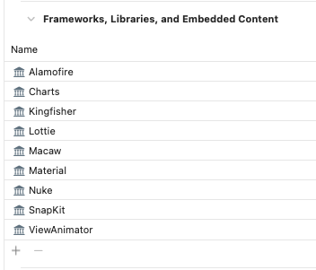
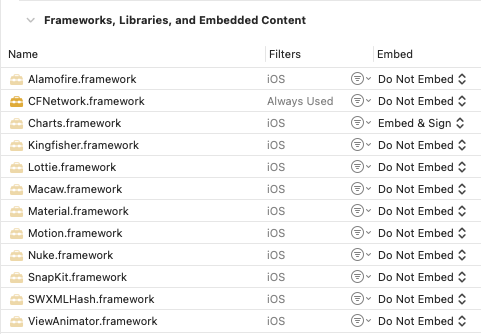
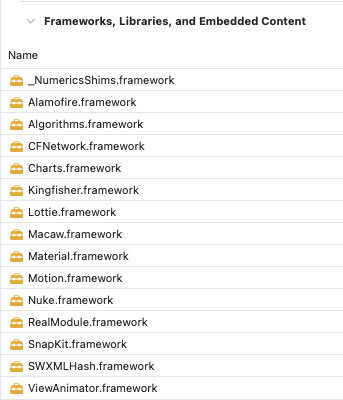
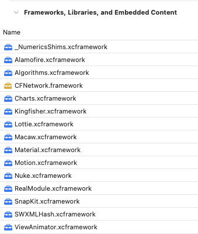
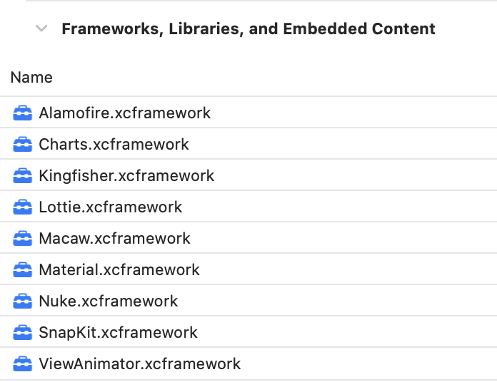
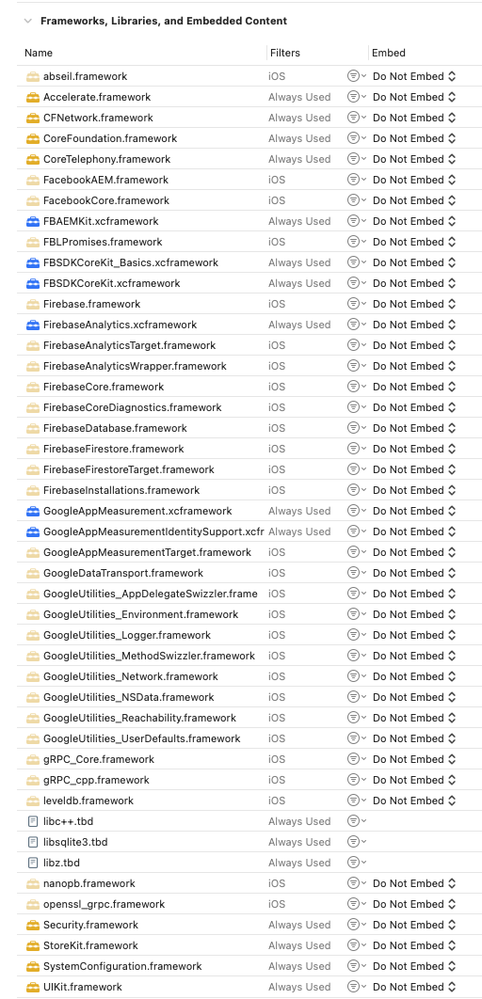
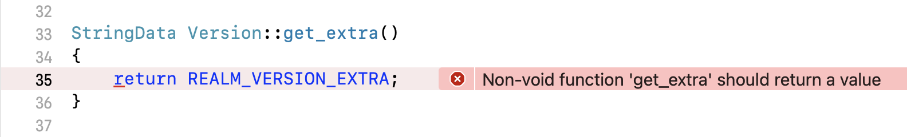
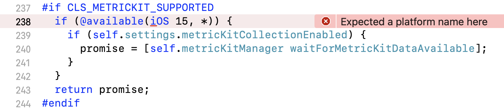

 

# Tuist.io (Havana) Dependencies Test Fixtures
This repository was added to support this article about how to improve the build time performance of an iOS application with external dependencies using Tuist.io to load the dependencies and generate the Xcode project, with fixtures providing a range of test cases. 

I selected 9 popular libraries on the basis that both Swift package and Carthage options are available, and that they follow the expected build process. (More about this below.) 

- Alamofire
- Charts
- Kingfisher
- Lottie
- Macaw
- Material
- Nuke
- SnapKit
- ViewAnimator

Currently there are only 2 ways of loading dependences: Swift Packages and Carthage. CocoaPods are not currently supported although this should be possible in a few months.  

### Swift Packages

For Swift Packages, once they are defined in the `Dependencies.swift` file, fetched, the cache warm command will compile them for the simulator, and then on running focus on the project an Xcode project is generated that has the dependencies linked as binary frameworks, thus massively reducing the clean compile time. 

Next, if the `--xcframeworks` option is added in the `cache warm` command, the dependencies are compiled for multiple architectures. Then if focus is run, again with the `--xcframeworks` option, the project is generated with the dependencies linked as multi-arch binary XCFrameworks. 

When `tuist cache warm` is run, the compiled frameworks can be found under `~/.tuist/Cache/BuildCache/<UUID>`. 

### Carthage
For Carchage dependencies, they compile straight into XCFrameworks so adding the flag is not necessary. On running `tuist dependencies fetch` this will checkout the code, doload it, and compile it for multiple architectures and build XCFrameworks stored under `Tuist/Dependencies/Carthage/Build`. There is no need to call `cache warm` here.

### Non-Standard Swift Package Dependencies 

There were a couple of unexpected behaviours observed with Firebase, Facebook, and the dependencies that they load. Rather than downloading everything as sources, the checkout contains binary XCFrameworks amongst the mix of dependencies. The XCFrameworks can be found under `Tuist/Dependencies/SwiftPackageManager/.build/artifacts` 

### Failing Dependencies
Finally some compile issues were observed with both Firebase Crashlytics and Realm, and they are grouped in a failing fixture: `AppWithFailingSPMDependencies`

## Test Fixtures

- Application with Swift Packages using the 1.x approach
- Application with Swift Packages using the 2.x approach
- Application with Carthage using the 2.x approach
- Application with Swift Packages using the 2.x approach, but load XCFrameworks by default
- Application with Swift Packages using the 2.x approach but fail to complie

## Build Time Comparisons
From these fixtures I took the first 3 to generate comparison data. 

I ran 5 clean builds for each of the following cases and took the average: 

	1: Swift Packages in the Project: The tuist 1.x approach
	2: Swift Packages defined in Dependencies: The tuist 2.x approach
	3: Swift Packages defined in Dependencies: The tuist 2.x approach with the cache warm feature
	4: Swift Packages defined in Dependencies: The tuist 2.x approach with the cache warm feature and XCFrameworks
	5: Carthage defined in Dependencies: The tuist 2.x approach

| Case | Compile C | Compile Swift | Total |
|---|---|---|---|
| 1  | 2.66  | 96.4  | 19.24  |
| 2  | 1.28  | 91.12  |  17.88 | 
| 3 |  0 | 0.85  | 1.54  |
| 4  | 0  | 0.67  | 1.5  |
| 5  | 0  | 0.4  |  1.48 |

The results show that there's a very good case for only using binary frameworks in Xcode projects for all dependencies, but there is very little difference whether Carthage or Swift Packages are used.  

## Fixture Details 

### Loading Swift Packages Using Tuist 1.x

    

Under the 1.x appraoch the packages are defined in the Project.swift manifest and these are loaded in a similar fashion to how Xcode loads Swift Packages. This fixture is here as a comparison for measuring clean build times.

### Loading Swift Packages Using Tuist 2.x

    

Run commands: 
 
	tuist dependencies fetch
	tuist generate 
	tuist focus <Project>
	
The generated Xcode project links all of the dependencies as source frameworks that need to be compiled and are represented as light yellow icons.

### Loading Swift Packages Using Tuist 2.x + Cache Warm

    

Run commands: 
 
	tuist dependencies fetch
	tuist cache warm
	tuist generate 
	tuist focus <Project>
	
The generated Xcode project links all of the dependencies as binary frameworks and are represented as solid yellow icons similar to those provided the OS.

### Loading Swift Packages Using Tuist 2.x + Cache Warm + XCFrameworks

    

Run commands: 
 
	tuist dependencies fetch
	tuist cache warm --xcframeworks
	tuist generate 
	tuist focus --xcframeworks <Project>
	
The generated Xcode project links all of the dependencies as multi-arch XCFrameworks and are represented as solid blue icons.

### Loading Carthage Using Tuist 2.x

    

Run commands: 
 
	tuist dependencies fetch
	
When Carthage dependencies are fetched, they are immediately compiled into multi-arch XCFrameworks. The generated Xcode project links all of the dependencies as XCFrameworks and are represented as solid blue icons similar to XCFrameworks generated from Swift Packages.

### Loading Swift Packages Using Tuist 2.x The Generate XCFrameworks

Most Swift Packages when fetched are linked as source frameworks, but in this fixture I highlight some of the more common exceptions: 

- FacebookSDK
- Firebase Analytics

After running dependencies fetch and focus this generates the Xcode project with these dependencies 

    

### Facebook SDK

After running `tuist dependencies fetch`, there are a number of XCFrameworks found in the path: 

`Tuist/Dependencies/SwiftPackageManager/.build/artifacts/Facebook`

They are:

	FBAEMKit.xcframework
	FBSDKCoreKit.xcframework
	FBSDKCoreKit_Basics.xcframework
	FBSDKGamingServicesKit.xcframework
	FBSDKLoginKit.xcframework
	FBSDKShareKit.xcframework
	FacebookGamingServices.xcframework

In this fixture not all of these are defined in the Project.swift as external dependencies so they are not listed. 

### Firebase

For Firebase, it loads `FirebaseAnalytics.xcframework` as well as the GoogleAppMeasurement frameworks: 

	GoogleAppMeasurement.xcframework
	GoogleAppMeasurementIdentitySupport.xcframework
	
### Compile Time Comparison 
Running a clean build for the 3 cases of source frameworks, binary frameworks and multi-arch XCFrameworks for the 2 dependences are as follows:  

	Default:
	Compile C: 624.998 seconds
	Compile Swift Sources: 1.567 seconds
	Total Time: 73.2 seconds 

	Framework:
	Compile C: 0 seconds
	Compile Swift Sources: 0.929 seconds
	Total Time: 1.7 seconds 

	XCFramework: 
	Compile C: 0 seconds
	Compile Swift Sources: 0.928 seconds
	Total Time: 1.9 seconds 
	
	SITREP
	------
	Files scanned: 1187
	Source lines of code: 498048

The total build time difference between cached frameworks and sources is massive, and essentially removes almost all the compile effort. I have noticed that increasing the number of frameworks has negligible impace on the overall build times. 
	
## Failing Fixture
	
Realm fails to compile with this error: 

    

Firebase Crashlytivs fails to compile with this and several similar errors: 

    

These are known issues and will be fixed in the near future. 

### Other Known Issues
If you run `dependencies fetch` and then modify the `Dependencies.swift` file, you can call `dependencies update`, but it doesn't always work. In those cases call `dependencies clean` and fetch again.

## Appendix

### Environment
The test environment was Xcode 13.2.1 running on Mac OS 12.0.1, MacBook Pro, M1 Processor. 16GB RAM.

Tuist version 2.6.0 (Havana)

### Compiler Times

Compile times for sources can be several times larger than the total time for building a project as the compiler takes full advantage of all the cores of the processor to run jobs in parallel. 

### Running Compile Comparisons
Clean build folder is selected in Xcode before each time build is selected. Then the build is selected using `Product > Perform Action > Build With Timing Summary`